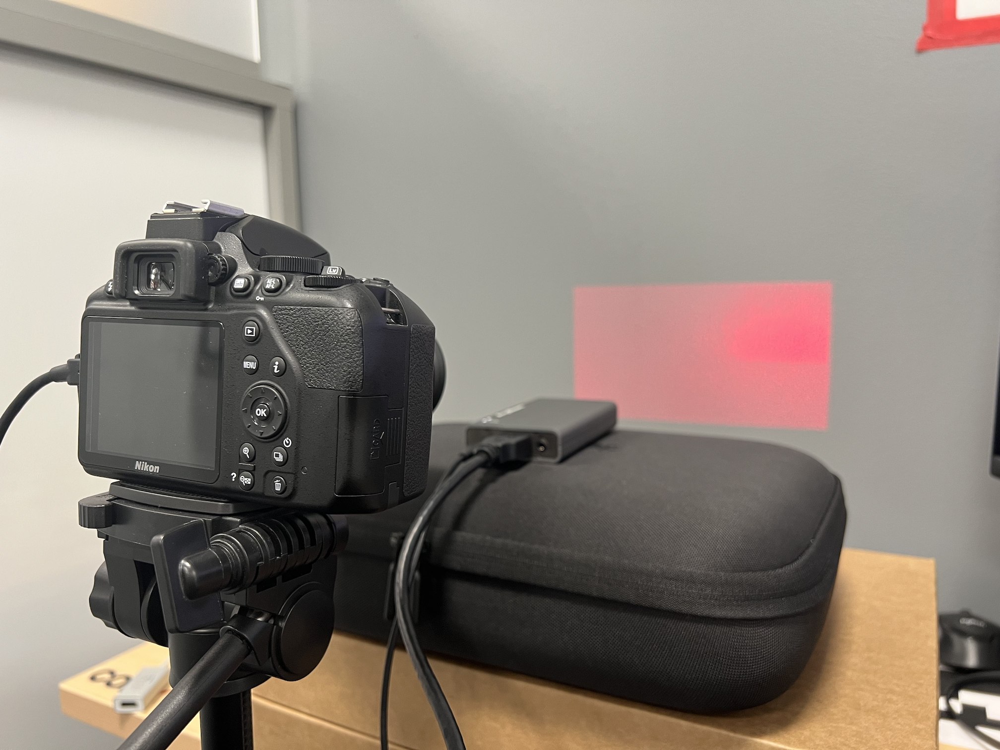
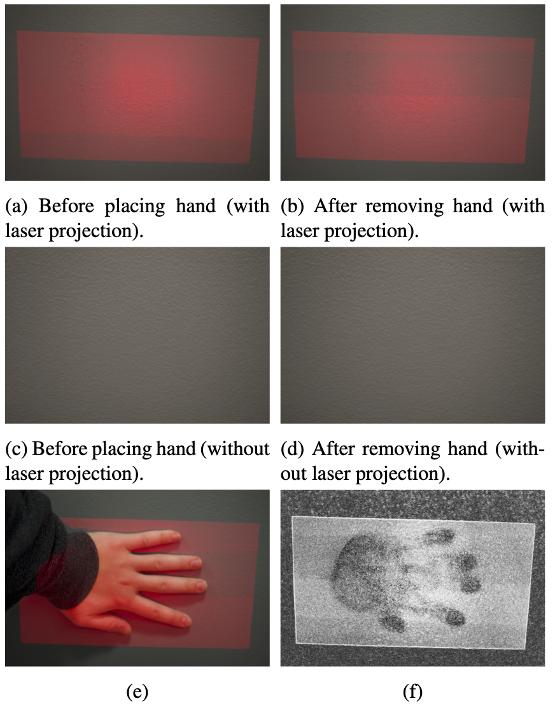
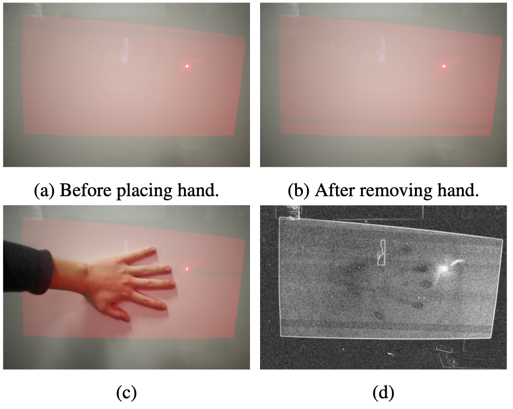
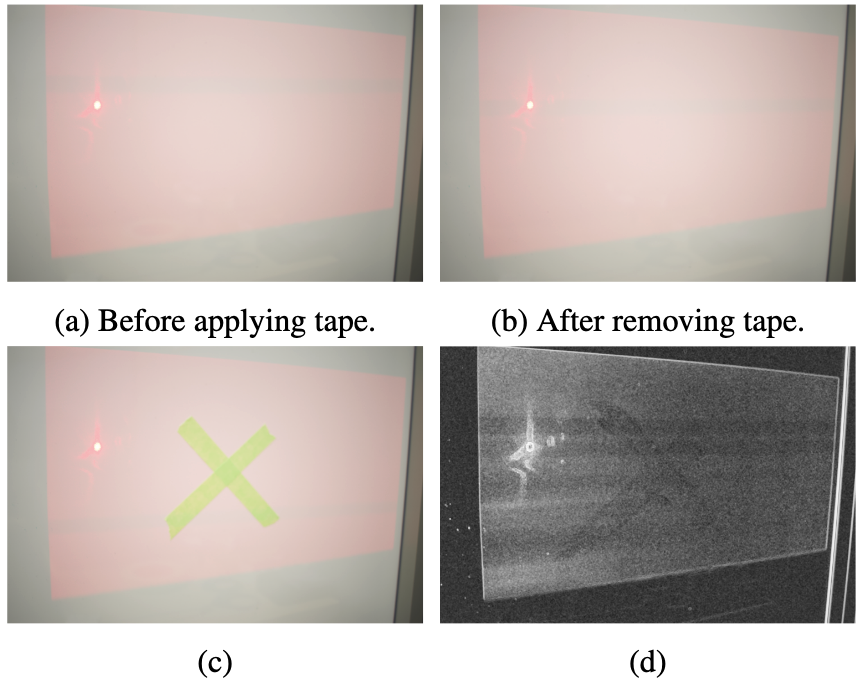
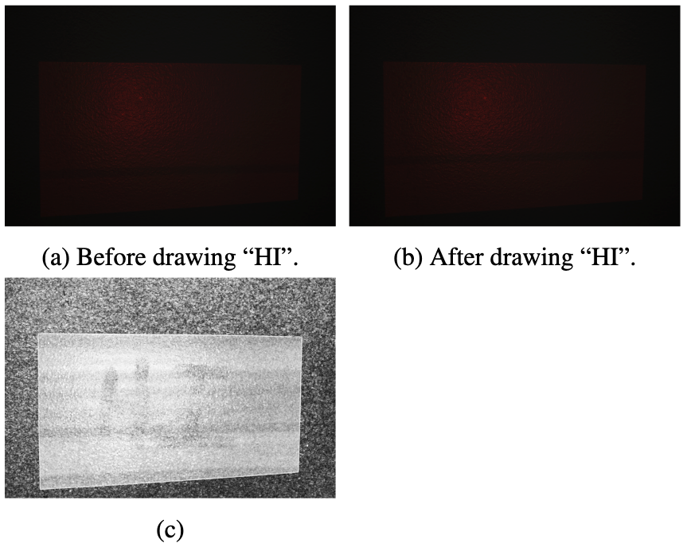

# 15-862 Computational Photography Final Project

This project is an implementation of the paper [Laser Speckle Photography for Surface Tampering Detection](http://groups.csail.mit.edu/graphics/speckle/).

Read the report [here](final_report.pdf). HD version [here](https://drive.google.com/file/d/1VLeq95FtER8mhS8v-RAnI4zvaT4ti_Bj/view?usp=sharing).

See the video [here](https://www.youtube.com/watch?v=e9CGhdTR1u0). mp4 file [here](https://drive.google.com/file/d/1VPkeQdxJgw_ZbQcjK-qdP7dvmiq2tU7n/view?usp=sharing)

## To use:

Install dependecies:
```
pip3 install -r requirements.txt
```

To run:
```
python3 project.py
```
You can edit the `trial` variable to point to different subdirectories of the `data/` directory. `img_1.tif` and `img_3.tif` in the subdirectory should be the before and after images, respectively. For example, `trial = "trial3"` will use images in the `data/trial3/` subdirectory.

The resulting similarity map between `data/<trial>/img_1.tif` and `data/<trial>/img_3.tif` will be found in `data/<trial>/S_<trial>.png`!!

Note: before you run `project.py`, you will need to convert the `.NEF` images to `.tif` images in each subdirectory of `data` using something like `dcraw`.

## Experimental Setup:
I used a Nikon 3500 DSLR camera and a AnyBeam laser scanning pico projector. I projected the `red.png` image on the laser projector.



## Results
A couple results of my experiments are shown below:



---


---


---

